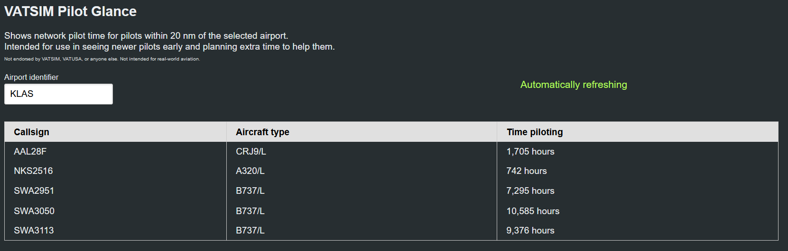

# vatsim_pilot_glance_online

It's like [vatsim_pilot_glance](https://github.com/Celeo/vatsim_pilot_glance), but a website rather than a TUI.

## Building

1. Install [deno](https://deno.land/) and [just](https://github.com/casey/just)
1. Clone <https://github.com/Celeo/vatsim_pilot_glance_online>
1. `cd vatsim_pilot_glance`
1. `just compile`

Note that the `./static` directory must be next to the binary when running.

## Installing

Either build from source, or get a binary from the [releases page](https://github.com/Celeo/vatsim_pilot_glance/releases).

## Using

Run the app. On the screen, supply the ICAO name of an airport and press enter.

Aircraft within the distance of the specified airport will be shown in a table with their
aircraft type (if they have a flight plan) and the number of hours they've been on VATSIM
as a pilot.

## License

Licensed under either of

* Apache License, Version 2.0, ([LICENSE-APACHE](LICENSE-APACHE))
* MIT license ([LICENSE-MIT](LICENSE-MIT))

## Contributing

Please feel free to contribute. Please open an issue first (or comment on an existing one) so that I know that you want to add/change something.

Unless you explicitly state otherwise, any contribution intentionally submitted for inclusion in the work by you, as defined in the Apache-2.0 license,
shall be dual licensed as above, without any additional terms or conditions.
